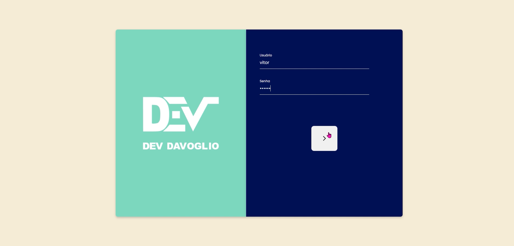
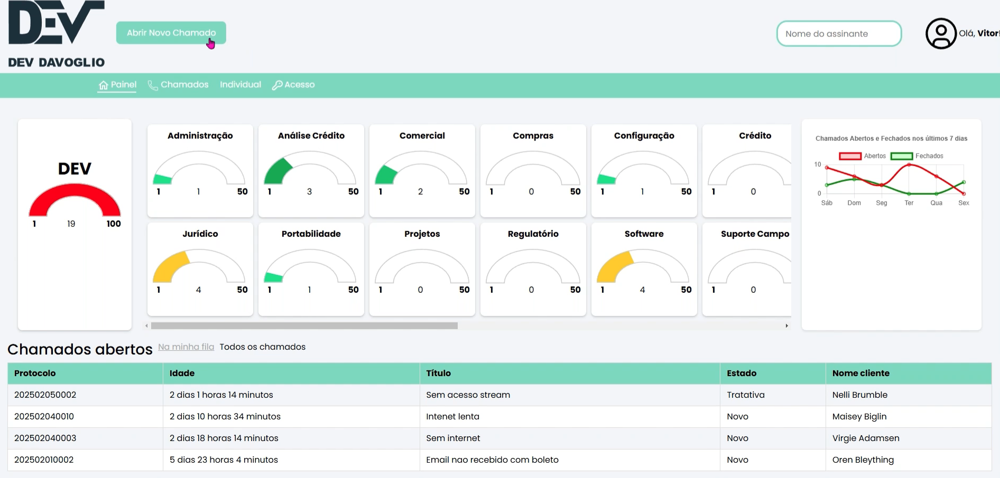
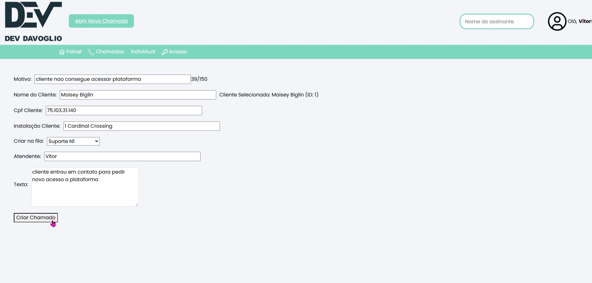
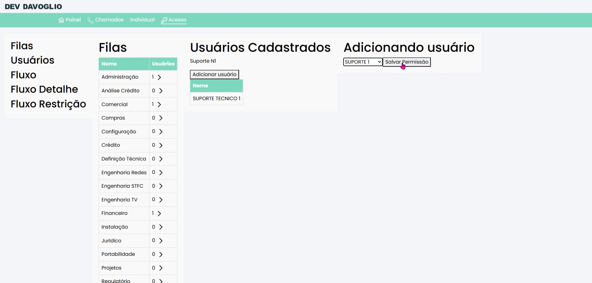

# Projeto Dashboard de Chamados

Este projeto é um site **Dashboard de Gestão de Chamados** em uma empresa, permitindo o acompanhamento e gerenciamento completo e eficiente dos chamados que foram criados nos setores da empresa.

## Tecnologias utilizada
**Front End:** React, HTML, CSS, TailwindCSS

**Back End:** Node.js, MySQL

**Ferramenta de Criação:** Figma

## Funcionalidades Principais

✅ Página principal
 * Exibe a quantidade total de chamados que estão abertos em cada setor
 * Gráfico com histórico de chamados abertos e fechados nos últimos 7 dias
 * Visualização dos chamados abertos atribuídos ao colaborador logado

✅ Criação e Pesquisa de chamados
 * Criar um novo chamado com nome do cliente, endereço, setor responsável, título e descrição detalhada do motivo do contato
 * Pesquisa de chamados por nome do cliente para verificar histórico e status

✅ Gestão individual de cada chamado
 * Visualização detalhada do fluxo do chamado desde a criação até a resolução
 * Registro de todas as movimentações do chamado (setores pelos quais passou, colaboradores envolvidos, ações realizadas)
 * Filtragem para o chamado atribuído ao setor e se o colaborador logado tem acesso
 * Atualização do chamado (redirecionamento para outro setor com descrição do que foi feito)
 * Adição de comentários internos sem mudar o setor do chamado
 * Finalização do chamado com uma nota de encerramento

✅ Gestão de Colaboradores (Acesso Admin)
 * Cadastro de novos colaboradores
 * Definição de permissões de acesso e setor de atuação

## Demonstração  📸
 Para demonstração do projeto foi utilizado o site https://www.mockaroo.com para gerar dados fictícios no projeto.

[![🎬 Página principal]](assets/login_principal.mp4)

[![🎬 Criação chamado]](assets/criacao_chamado.mp4)

[![🎬 Gestão individual chamado]](assets/individual_comentario.mp4)

[![🎬 Controle de acesso]](assets/controle_acesso.mp4)

## Melhorias Futuras 📌
 * 📍 Implementação de notificações em tempo real
 * 📍 Melhorias na UI/UX
 * 📍 Relatórios personalizados por período

## Desenvolvimento 🚀
 @VitorVDavoglio